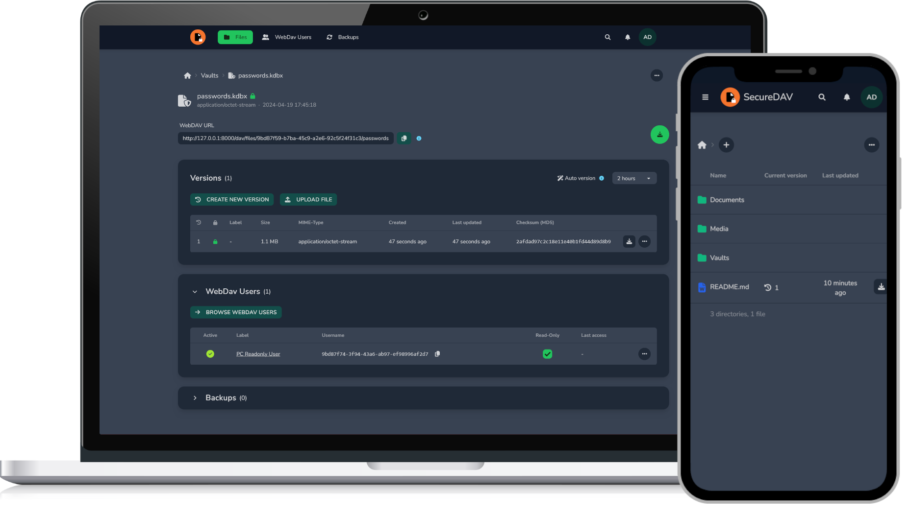

# SecureDAV  

## Description

SecureDAV is a secure file storage which also acts as a WebDAV server with specific access controls. It is built as a web application using the [Laravel framework](https://laravel.com/). The application is designed to be self-hosted and can be run on a server of your choice.

## Features

- File management
- File versioning
- WebDAV access with independent users (having specific access rights)
- File encryption on the server
- Automatic backups
- 2FA (Two-factor authentication)

## Installation and Upgrade Guide

For system requirements, installation/upgrade guides, troubleshooting etc., head over to the [Official Documentation](https://m-thalmann.github.io/SecureDAV).

## Development

Head over to the [Official Documentation](https://m-thalmann.github.io/SecureDAV) for the development guide.

## License

SecureDAV is open-sourced software licensed under the [MIT license](./LICENSE).
